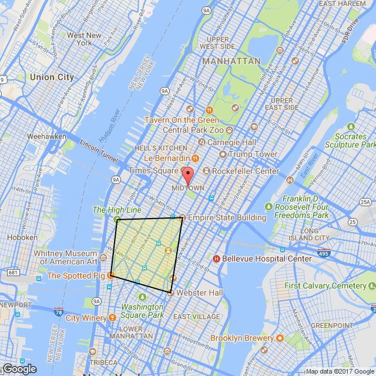

# Static Maps
A PHP library to make working with the Google Static Maps API (and, eventually, others) a little more friendly.

**Note:** This library is in active development. Refactoring needs to be done, features need added, and the API needs finalized. While the code *should* be relatively stable, you're cautioned against using this in a production environment.

## Installation
Composer is the recommended method of installation.
 
```
composer require sparkscoding/static-maps
```

## Quick Example

```php
use SparksCoding\StaticMaps\StaticMap;
use SparksCoding\StaticMaps\Components\Map;
use SparksCoding\StaticMaps\Components\Marker;
use SparksCoding\StaticMaps\Components\Feature;
use SparksCoding\StaticMaps\Components\Element;

// Initialize the map by adding your API key
$staticMap = StaticMap::key('123yOUrAPIkeYGoeSHerE123');

// Set the builder
$staticMap->setBuilder(
    '\SparksCoding\StaticMaps\Builders\GoogleStaticMapBuilder'
);

// Add a map
$staticMap->setMap(
    Map::create()->center('New York, NY')->zoom(10)
);

// Add a couple markers
$staticMap->addMarkers(
    Marker::location('New York, NY'),
    Marker::location('Brooklyn, NY')
);

// Style the roads
$staticMap->addStyles(
    Feature::name('road')->elements(
        Element::name('geometry')->color('blue')
    )
);

// Add a path
$staticMap->addPath(
  Path::points([
      'Empire State Building',
      'Webster Hall',
      'The Spotted Pig',
      'The High Line',
      'Empire State Building',
  ])->color('0x000000ff')->fillcolor('0xFFFF0033')->weight(2)
);

echo 'uri() . '">';
```
Output:



## Documentation

Documentation for Static Maps is currently in progress. 

## To-Do

* Documentation